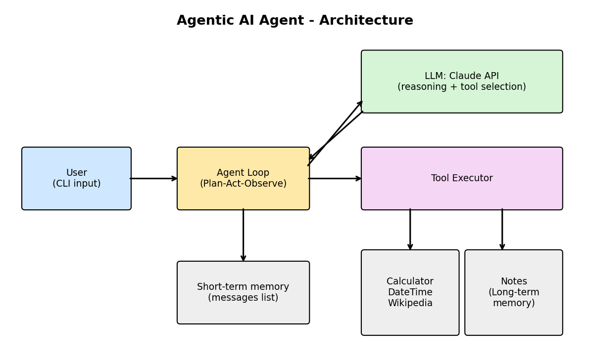
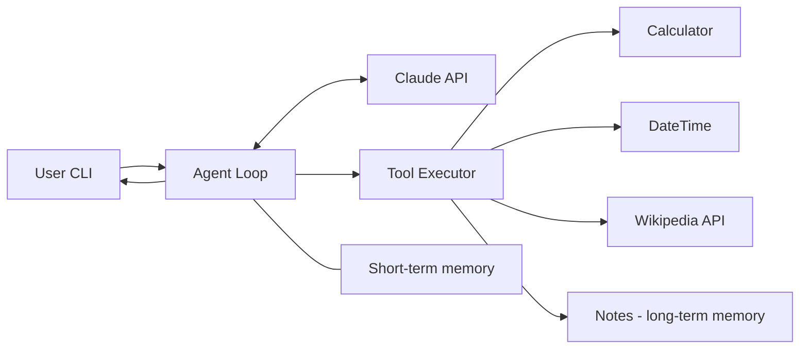

# Schema / Architecture

```mermaid
flowchart LR
  U[User CLI] --> A[Agent Loop]
  A <--> L[Claude API]
  A --> T[Tool Executor]
  T --> C[Calculator]
  T --> D[DateTime]
  T --> W[Wikipedia API]
  T --> N[Notes - long-term memory]
  A --- M[Short-term memory]
  A --> U
```

**Flow:** User goal -> LLM plans -> picks a tool -> tool runs -> result fed back -> loop until final answer (max 8 steps).
